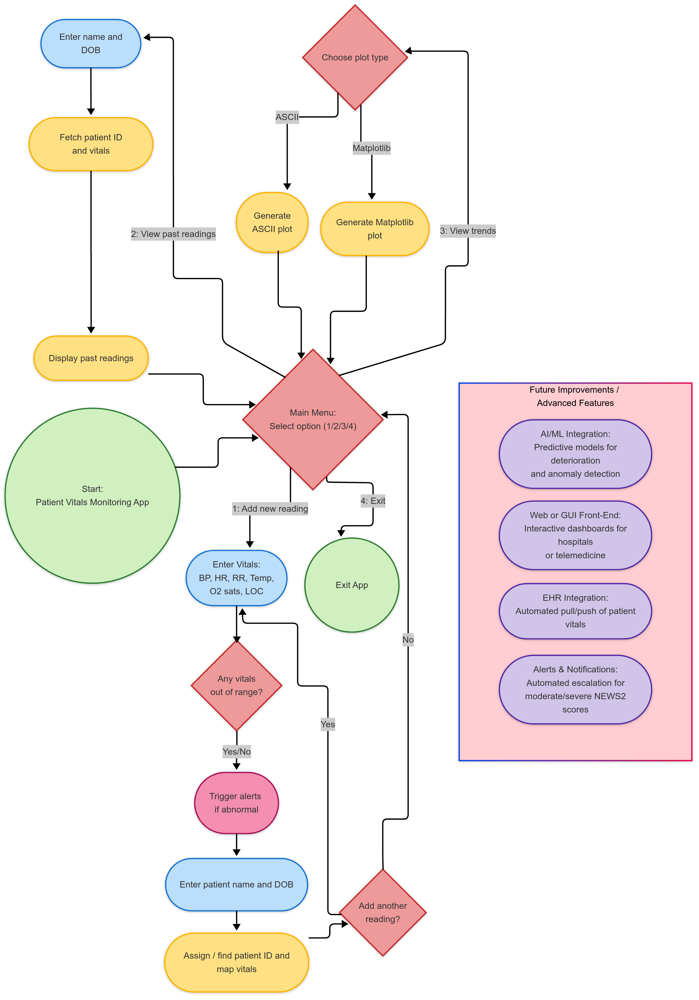
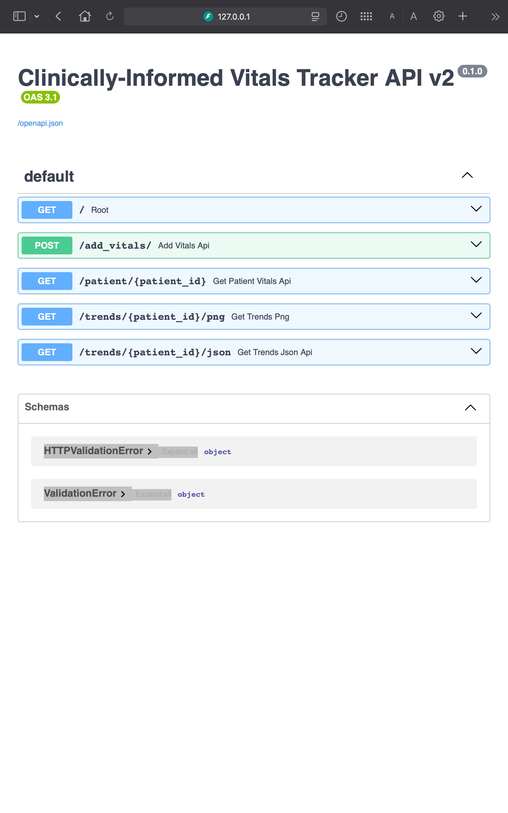
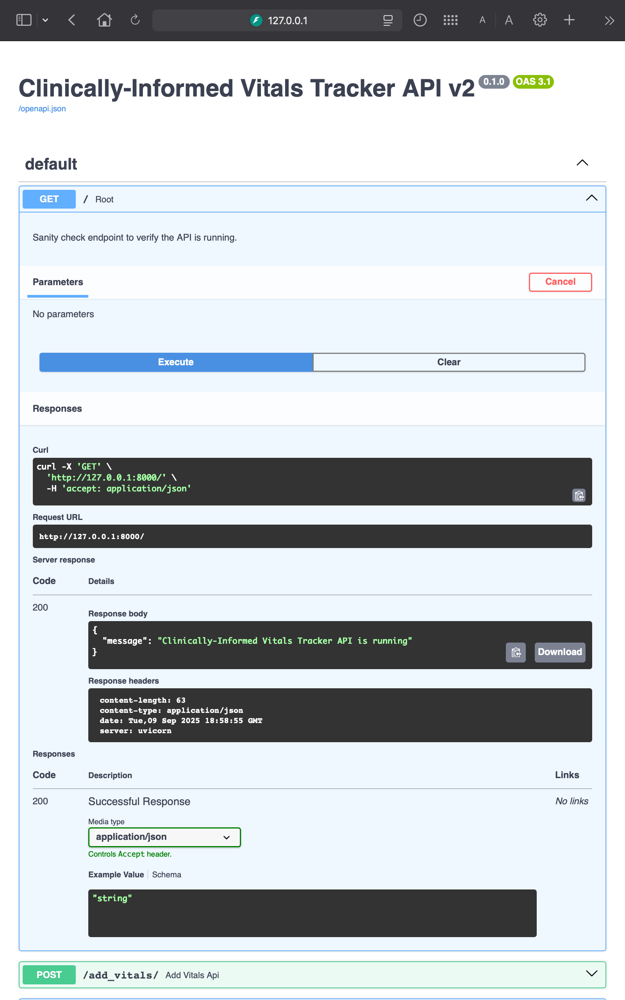
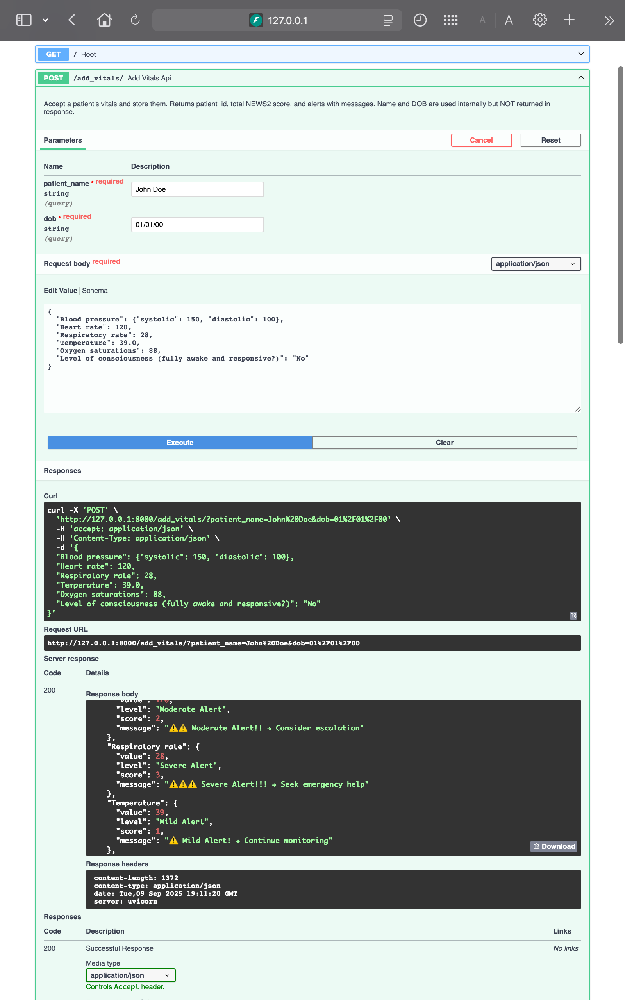
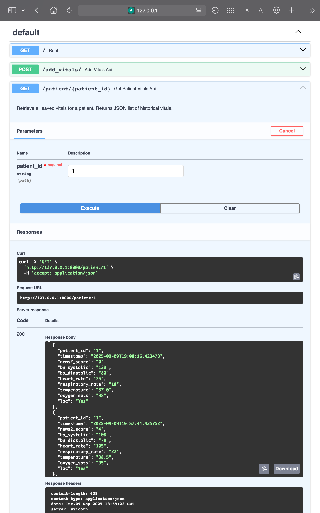
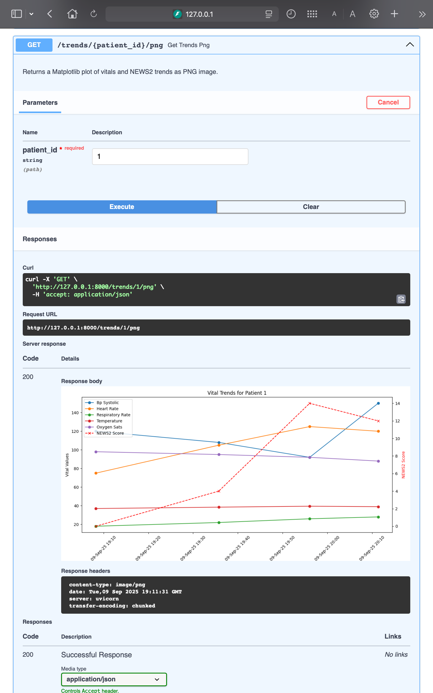
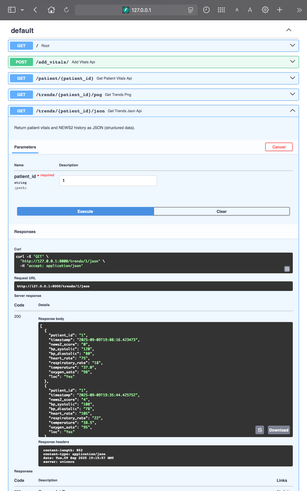
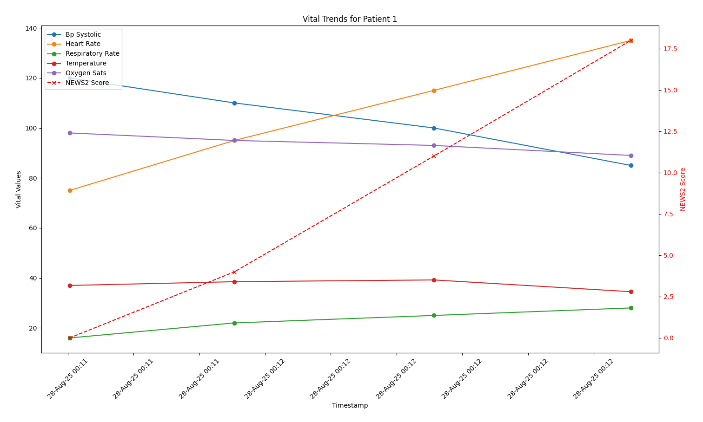

# 𝐁𝐮𝐢𝐥𝐝𝐢𝐧𝐠 𝐚 NEWS2 𝐏𝐲𝐭𝐡𝐨𝐧 𝐂𝐋𝐈 & Fast𝐀𝐏𝐈 𝐕𝐢𝐭𝐚𝐥𝐬 𝐓𝐫𝐚𝐜𝐤𝐞𝐫 🩺📈
**Python | CLI Tool | FastAPI | Pydantic | JSON Output | NEWS2 Scoring | ASCII & Matplotlib Visualisation | Clinically-Informed**


<!-- Tech Stack -->
 
 
 
 
 


<!-- Testing & CI/CD -->
 
 
  


<!-- Deployment -->
[](https://vitals-tracker-cli.onrender.com/docs) 


<!-- Repository Info -->
 
 
 
 
 


A **Python-based CLI and FastAPI tool** for **comprehensive patient vitals tracking**, **real-time NEWS2 scoring**, and **trend visualisation**, designed to replicate real clinical workflows. Users can interact via **command-line prompts (CLI)** or a **deployable FastAPI JSON API (v2)**. Outputs are **clinically interpretable**, include **tiered alerts**, and support **longitudinal monitoring** with CSV persistence.

Supports clinicians in real-time patient monitoring; reduces risk of missed deterioration; integrates seamlessly into hospital EHRs; provides actionable alerts with NEWS2 scoring.

The **v2 API is live on Render** ([click here](https://vitals-tracker-cli.onrender.com/docs)) and continuously validated via GitHub Actions.

**ASCII charts** provide lightweight terminal-based monitoring, while **Matplotlib plots** deliver portfolio-ready, professional visualisations. Data is persistently stored in **CSV with patient mapping**, supporting **longitudinal monitoring** and future AI/ML integration, and robust input validation for clinical reliability.

This system prioritises clinically meaningful metrics, produces **interpretable outputs that reflect true clinical reasoning**, and demonstrates how a clinician’s domain knowledge directly informs scoring, alerts, and trend interpretation. 

A **deployable backend** with API endpoints highlights production-readiness and makes the project recruiter-ready, showcasing both CLI and web-accessible functionality.

---

## CLI vs FastAPI: Skills Showcase

| Feature | CLI (v1) | FastAPI (v2 - Live on Render) |
|---------|-----------|-------------------------------|
| **User Interaction** | Command-line prompts, numeric & categorical inputs | JSON-based API requests (`GET /Root`, `POST /add_vitals/`, `GET /patient/{patient_id}`, `GET /trends/{patient_id}/png/`, `GET /trends/{patient_id}/json/`) |
| **Data Entry** | Manual typing via terminal | Scriptable input via HTTP requests or Swagger UI |
| **Visualisation** | ASCII bar charts; Matplotlib plots saved locally | API returns JSON data; Matplotlib plots generated on server as PNG |
| **Alerts & Scoring** | NEWS2 scoring, tiered alerts printed to console | NEWS2 scoring calculated server-side; alerts included in structured JSON response |
| **Persistence** | CSV storage with unique patient IDs | CSV storage leveraged for backend; data retrieval via endpoints |
| **Testing & CI/CD** | Manual verification of CLI workflows | Automated endpoint validation using GitHub Actions, ensuring production-readiness |
| **Clinical Insight** | Real-time feedback at bedside; supports immediate clinical decision-making | Enables integration into EHRs, dashboards, or telemedicine apps, supports remote monitoring and analytics |


---


## System Workflow


*Figure 1: Overview of patient vitals input, NEWS2 scoring, alert logic, and trend visualisation workflow.*


---

## Clinical & Technical Highlights

- **Clinically-informed input handling**: Collects vitals and level of consciousness, mapping to structured format.  
- **Tiered alert logic**: NEWS2 score reflects severity levels clinicians use for escalation decisions.  
- **Trend visualisation**: ASCII charts for quick CLI checks; Matplotlib plots for detailed analysis and portfolio showcase.  
- **Patient ID anonymisation**: Ensures privacy and GDPR-compliance for multi-patient tracking.  
- **Robust error handling**:
    - Handles CSV header mismatches, data type conversions, and overlapping alert thresholds.  
    - Ensures reliable plotting and accurate historical analysis.  
- **Modular architecture**: Functions separated by responsibility (input, scoring, alerting, visualization) for maintainability and expansion.  
- **Foundation for predictive analytics**: Clinically-informed scoring and trend data enable future AI/ML models for deterioration detection and decision support.  


---


## How It Works

1. **User Input**  
   - Collects patient vitals (BP, HR, RR, Temp, O₂ sats, Level of Consciousness) via CLI.  
   - Validates input ranges and types to ensure clinical reliability.  
   - Maps multiple patients to anonymized IDs for longitudinal tracking.

2. **Scoring & Alerts**  
   - Computes **NEWS2 score** based on entered vitals.  
   - **Integrated NEWS2 scoring determines tiered alert level** (Normal → Mild → Moderate → Severe) reflecting real-world clinical prioritisation.  
   - Provides user-friendly alert messages highlighting actionable concerns.

3. Trend & Output Display
   - Prints recent patient readings with aligned formatting for readability.  
   - **Generates visualisations**:
     - ASCII charts for quick terminal-based monitoring.  
       *Provides lightweight, real-time monitoring in terminal environments for quick interpretation during ward rounds or telemedicine sessions.*
     - Matplotlib plots for portfolio-quality, dual-axis trends (vitals + NEWS2).  
       *Enables detailed longitudinal monitoring, supporting clinical review, handover, and identification of subtle deterioration patterns over time.*
   - Supports retrieval of historical data for multiple patients, enabling longitudinal trend analysis.


---


## CLI Technical Highlights

- **Robust input validation**: Ensures safe ranges, correct data types, and consistent nested data structures.
- **Comprehensive error handling**:
    - Fixed CSV header issues to avoid KeyErrors.
    - Type conversion for plotting prevents string/float errors.
    - Adjusted diastolic BP alert ranges to prevent overlapping thresholds.
- **Data persistence**: Stores historical readings in CSV (vitals.csv) with patient mapping (patient_mapping.csv).
- **Nested dictionary flattening**: for CSV compatibility and smooth plotting.
- **ASCII normalisation**: Values scaled proportionally to fixed-width bars for quick interpretation.
- **Matplotlib dual-axis plotting**: Overlay NEWS2 scores with vitals over time.
- **Timestamp formatting**: ISO timestamps converted and formatted for readability in plots.
- **Failsafes and edge-case handling**:
    - Minimum/maximum values handled in ASCII plots.
    - Alert thresholds with default 0 if no match found.

---


## Architecture & Implementation

**Key Components**
1.	**Data Persistence**
	- **save_to_csv()**: Writes flattened vitals with patient ID, timestamp, and NEWS2 score.
	- **load_from_csv()**: Retrieves historical readings for a given patient.
2.	**Patient Management**
	- **get_or_create_patient_id()**: Maps multiple patients to unique IDs. Patient ID anonymisation ensure GDPR-compliant data handling
	- **find_patient_id()**: CLI interface to locate patient ID via full name + DOB.
3.	**Input & Validation**
	- **user_inputs()**: Collects vitals in nested dictionary form.
	- **validate_input()**: Ensures numeric values are within safe clinical ranges.
	- Level of Consciousness handled as categorical input (Yes/No/Unsure).
4.	**Alert & Scoring**
	- **check_alert()**: Determines tiered alert level per NEWS2.
	- **get_alert_message()**: Converts alert level to user-friendly message.
	- **Scores summed for total NEWS2**; systolic BP counts in total, diastolic printed only.
5.	**Display**
    - **print_patient_vitals()**: Prints last 5 historical readings with alignment for readability.
	- **plot_ascii()**: ASCII-based trend visualisation for lightweight terminal output.
	- **plot_matplotlib()**: Professional Matplotlib plots with dual-axis for vitals + NEWS2.
6.	**CLI Loop**
    - **Options**: Add Reading, View Past Readings, View Trends, Exit.
    - Nested loops for multiple readings, plotting options, and patient queries.


---


## v2 — API Deployment with FastAPI (LIVE)

**Python | FastAPI | Pydantic | JSON Output | Render**

### Live Demo

- Deployed API on Render: [https://vitals-tracker-cli.onrender.com/docs](https://vitals-tracker-cli.onrender.com/docs)  
- API endpoints:
  - `GET /Root` → {"message":"Clinically-Informed Vitals Tracker API is running"}
  - `POST /add_vitals/` → Add new patient vitals; returns NEWS2 + alerts  
  - `GET /patient/{patient_id}` → Retrieve patient history  
  - `GET /trends/{patient_id}/png` → Matplotlib plot (PNG)  
  - `GET /trends/{patient_id}/json` → Historical vitals & NEWS2 as JSON

### Overview

- CLI logic wrapped into deployable API  
- JSON output includes:
  - `patient_id`  
  - `total_news2_score`  
  - `alerts` (clinically structured)  
- Modular separation of CLI vs API code for maintainability and integration.  
- Enables future integration with your **Early Warning Score (EWS) project** for predictive clinical monitoring.

### Endpoints

| Endpoint | Method | Description |
|----------|--------|-------------|
| `/Root` | GET | Sanity check confirming API is running |
| `/add_vitals/` | POST | Input: patient_name, dob, vitals JSON; Output: patient_id, total NEWS2, alerts |
| `/patient/{patient_id}` | GET | Retrieve all saved vitals for a patient as JSON list |
| `/trends/{patient_id}/png` | GET | Matplotlib plot of vitals + NEWS2 trends |
| `/trends/{patient_id}/json` | GET | Vitals and NEWS2 history as JSON |

### API JSON Output Keys

**1. Add Vitals Response (`POST /add_vitals/`)**

| Key | Description |
|-----|-------------|
| `patient_id` | Unique identifier for the patient (generated by the system) |
| `total_news2_score` | Calculated NEWS2 score based on the submitted vitals |
| `alerts` | Clinically structured dictionary of alert messages per vital sign; includes: |
| | - `value`: numeric or string value of the vital |
| | - `level`: severity category (e.g., Normal, Mild Alert, Moderate Alert, Severe Alert) |
| | - `score`: NEWS2 points assigned for that vital |
| | - `message`: Clinical advice or escalation recommendation |

**2. Fetch Past Readings (`GET /patient/{patient_id}`)**

Returns a list of historical readings:

| Key | Description |
|-----|-------------|
| `patient_id` | Unique patient identifier |
| `timestamp` | ISO 8601 datetime of the reading |
| `news2_score` | NEWS2 score at that timestamp |
| `bp_systolic` | Systolic blood pressure |
| `bp_diastolic` | Diastolic blood pressure |
| `heart_rate` | Heart rate (bpm) |
| `respiratory_rate` | Respiratory rate (breaths per minute) |
| `temperature` | Body temperature (°C) |
| `oxygen_sats` | Oxygen saturation (%) |
| `loc` | Level of consciousness (`Yes` = fully awake, `No` = not fully awake) |

**3. Trends Responses**

**PNG Plot (`GET /trends/{patient_id}/png`)**
- Returns a binary image file of vital trends over time (Matplotlib plot).

**JSON Trend Data (`GET /trends/{patient_id}/json`)**
- Returns historical vitals in JSON format.
- Keys are identical to the **Fetch Past Readings** endpoint.

### API Screenshots

  
*Figure 2: FastAPI Swagger UI home page showing available endpoints.*

  
*Figure 3: /Root endpoint returning a confirmation message.*

  
*Figure 4: /add_vitals endpoint example adding vitals and structured JSON response with NEWS2 score and alerts.*

  
*Figure 5: /patient endpoint example fetches past readings for a patient, showing historical data in JSON format.*

  
*Figure 6: /trends endpoint example returns a PNG plot of historical vital trends over time generated via Matplotlib.*

  
*Figure 7: /trends endpoint example returns historical vital trends over time as JSON.*


### Root Endpoint

```Python
@app.get("/")
def root():
    return {"message": "Clinically-Informed Vitals Tracker API is running"}
```


### API Testing / CI

Automated endpoint tests are run using GitHub Actions to ensure the API deployment works correctly.

- **Workflow file**: `.github/workflows/fastapi-app.yml`  
- Uses **pytest** and **httpx** to test endpoints locally and against the live deployment.
- **Tests include**:
  - `GET /` returns `200` and a JSON message confirming the API is running.
  - `POST /add_vitals/` accepts a sample vitals payload, returns `patient_id`, `total_news2_score`, and `alerts`.
  - `GET /patient/{patient_id}` returns a list of historical readings.
  - Basic validation that responses have correct JSON structure and data types.

**Example test snippet**:

```python
from fastapi.testclient import TestClient
from v2_api.app import app

client = TestClient(app)

def test_root_endpoint():
    # Test that the root endpoint returns a 200 and contains a message
    response = client.get("/")
    assert response.status_code == 200
    assert "message" in response.json()

def test_add_vitals_and_fetch():
    # Sample vitals payload
    vitals_payload = {
        "Blood pressure": {"systolic": 120, "diastolic": 80},
        "Heart rate": 75,
        "Respiratory rate": 18,
        "Temperature": 37.0,
        "Oxygen saturations": 98,
        "Level of consciousness (fully awake and responsive?)": "Yes"
    }
```
- Workflow triggers:
  - Push to main
  - Scheduled weekly checks

This demonstrates a production-ready backend with continuous validation.


### How to run locally

```bash
cd v2_api
uvicorn app:app --reload
```

- Visit http://127.0.0.1:8000/docs for interactive Swagger UI
- Use the UI to test endpoints such as:
    - GET /Root → sanity check that the API is running
    - POST /add_vitals/ → add new patient vitals and receive NEWS2 scores + alerts
    - GET /patient/{patient_id} → fetch historical vitals for a patient
    - GET /trends/{patient_id}/png → retrieve Matplotlib trend plot as PNG
    - GET /trends/{patient_id}/json → fetch historical vitals and NEWS2 scores as JSON
- You can also test endpoints programmatically using httpx or your own scripts.


### Notes / Future Work
- Demonstrates production-ready backend for a clinician-technologist portfolio
- JSON outputs and CSV persistence make it easy to integrate into dashboards, hospital EHRs, or telemedicine apps
- Future improvements:
	- Add automated notifications/alerts for moderate or severe NEWS2 scores.
	- Integrate predictive AI/ML models for patient deterioration detection.
	- Expand support for additional vital signs or custom scoring systems.
	- Implement persistent logging and analytics for longitudinal patient data.
- No frontend required; API + CLI + deployment is enough for portfolio showcase

---

## Future Improvements

- **AI/ML Integration**: Predictive models for deterioration, anomaly detection.
- **Web or GUI Front-End**: Interactive dashboards for hospitals or telemedicine.
- **EHR Integration**: Directly pull/push patient vitals for automated trend analysis.
- **Alerts & Notifications**: Automated escalation for moderate/severe NEWS2 scores.

---


## Quick Start

**Clone and run**:

```bash
git clone https://github.com/SimonYip22/vitals-tracker-cli.git
cd vitals-tracker-cli
python3 vitals_tracker.py
```

- Follow CLI prompts to add readings, view past vitals, or plot trends.
- Select ASCII for lightweight monitoring or Matplotlib for portfolio-ready visuals.

---


## CLI Matplotlib Plot Example


*Figure 8: Professional trend visualisation of a patient’s vitals over time, highlighting systolic BP, heart rate, respiratory rate, temperature, oxygen saturations, and NEWS2 scores. Enables clinicians to rapidly detect deterioration and make informed escalation decisions.*

- **The included `vitals-tracker-matplotlib.png` demonstrates a sample patient's vitals trends over time. It includes**:
    - **Line plots for key vital signs**: Systolic BP, Heart Rate, Respiratory Rate, Temperature, and Oxygen Saturations.
    - **Dual-axis plotting**: Vitals on the primary y-axis and NEWS2 scores on the secondary y-axis (red dashed line).
    - Markers at each data point for clarity.
    - Formatted timestamps on the x-axis for readability.
- This PNG exemplifies the professional plotting capabilities of the CLI tool and can be used in portfolio showcases or presentations to illustrate the trend visualisation functionality.

---


## CLI Example session

```text
Patient vitals Monitoring App
=============================
1. Add new reading
2. View past readings
3. View trends
4. Exit

Select an option (1/2/3/4): 1
=== Enter Patient Vitals ===
Systolic BP (mmHg): 120
Diastolic BP (mmHg): 80
Heart Rate (bpm): 75
Respiratory Rate (bpm): 16
Temperature (°C): 37
Oxygen Saturation (%): 98
Fully awake and responsive? (Yes/No/Unsure): Yes
Vitals recorded successfully!
Total NEWS2 score: 0
```

```text
Patient vitals Monitoring App
=============================
1. Add new reading
2. View past readings
3. View trends
4. Exit

Select an option (1/2/3/4): 2
Enter full name: simon yip
Please enter date of birth (dd/mm/yy): 26/11/00
Patient found. ID: 1. Retrieving vitals...

Vitals for patient 1:

Patient has 4 recorded vital sign entries. Showing the last 4:
2025-08-28T00:11:30.266959 | BP: 120/ 80 mmHg | HR:  75 bpm | RR:  16 bpm | Temp:    37 °C | O2 sats:  98 % | Awake and fully responsive?: Yes | 
------------------------------------------------------------------------------------------------------------------------------------------------------------------------------------
2025-08-28T00:11:55.336599 | BP: 110/ 75 mmHg | HR:  95 bpm | RR:  22 bpm | Temp:  38.5 °C | O2 sats:  95 % | Awake and fully responsive?: Yes | 
------------------------------------------------------------------------------------------------------------------------------------------------------------------------------------
2025-08-28T00:12:25.660340 | BP: 100/ 70 mmHg | HR: 115 bpm | RR:  25 bpm | Temp:  39.2 °C | O2 sats:  93 % | Awake and fully responsive?: Yes | 
------------------------------------------------------------------------------------------------------------------------------------------------------------------------------------
2025-08-28T00:12:55.637678 | BP:  85/ 55 mmHg | HR: 135 bpm | RR:  28 bpm | Temp:  34.5 °C | O2 sats:  89 % | Awake and fully responsive?: No/Unsure | 
------------------------------------------------------------------------------------------------------------------------------------------------------------------------------------
View another past reading? (y/n): n
```

```text
Patient vitals Monitoring App
=============================
1. Add new reading
2. View past readings
3. View trends
4. Exit

Select an option (1/2/3/4): 3
Enter full name: simon yip
Please enter date of birth (dd/mm/yy): 26/11/00
Patient found. ID: 1. Retrieving vitals...
View trends as (1) ASCII or (2) matplotlib? 1

news2_score trends:
2025-08-28T00:11:30.266959 |   0.0 | 

------------------------------------------------------------
2025-08-28T00:11:55.336599 |   4.0 | ###########

------------------------------------------------------------
2025-08-28T00:12:25.660340 |  11.0 | ##############################

------------------------------------------------------------
2025-08-28T00:12:55.637678 |  18.0 | ##################################################

------------------------------------------------------------

bp_systolic trends:
2025-08-28T00:11:30.266959 | 120.0 | ##################################################

------------------------------------------------------------
2025-08-28T00:11:55.336599 | 110.0 | ###################################

------------------------------------------------------------
2025-08-28T00:12:25.660340 | 100.0 | #####################

------------------------------------------------------------
2025-08-28T00:12:55.637678 |  85.0 | 

------------------------------------------------------------

bp_diastolic trends:
2025-08-28T00:11:30.266959 |  80.0 | ##################################################

------------------------------------------------------------
2025-08-28T00:11:55.336599 |  75.0 | ########################################

------------------------------------------------------------
2025-08-28T00:12:25.660340 |  70.0 | ##############################

------------------------------------------------------------
2025-08-28T00:12:55.637678 |  55.0 | 

------------------------------------------------------------

heart_rate trends:
2025-08-28T00:11:30.266959 |  75.0 | 

------------------------------------------------------------
2025-08-28T00:11:55.336599 |  95.0 | ################

------------------------------------------------------------
2025-08-28T00:12:25.660340 | 115.0 | #################################

------------------------------------------------------------
2025-08-28T00:12:55.637678 | 135.0 | ##################################################

------------------------------------------------------------

respiratory_rate trends:
2025-08-28T00:11:30.266959 |  16.0 | 

------------------------------------------------------------
2025-08-28T00:11:55.336599 |  22.0 | #########################

------------------------------------------------------------
2025-08-28T00:12:25.660340 |  25.0 | #####################################

------------------------------------------------------------
2025-08-28T00:12:55.637678 |  28.0 | ##################################################

------------------------------------------------------------

temperature trends:
2025-08-28T00:11:30.266959 |  37.0 | ##########################

------------------------------------------------------------
2025-08-28T00:11:55.336599 |  38.5 | ##########################################

------------------------------------------------------------
2025-08-28T00:12:25.660340 |  39.2 | ##################################################

------------------------------------------------------------
2025-08-28T00:12:55.637678 |  34.5 | 

------------------------------------------------------------

oxygen_sats trends:
2025-08-28T00:11:30.266959 |  98.0 | ##################################################

------------------------------------------------------------
2025-08-28T00:11:55.336599 |  95.0 | #################################

------------------------------------------------------------
2025-08-28T00:12:25.660340 |  93.0 | ######################

------------------------------------------------------------
2025-08-28T00:12:55.637678 |  89.0 | 

------------------------------------------------------------
```

- Full sample_run.md included demonstrating normal → severe alerts, past readings, ASCII trends, and Matplotlib plots.

---

## Running Tests

**Test the CLI workflows, NEWS2 scoring, CSV persistence, and plotting functions**:

```bash
pytest -v
```
**Tests include:**
- Validation of vital sign input ranges (validate_input)
- Correct NEWS2 alert level assignment (check_alert, get_alert_message)
- Flattening of nested vitals for CSV storage (flatten_vitals)
- Patient management and CSV persistence (get_or_create_patient_id, save_to_csv, load_from_csv)
- Display functions and CLI output (print_patient_vitals)
- Trend visualisation functions (plot_ascii, plot_matplotlib)

---


## Project Structure

```text
vitals-tracker-cli/
├── .github/
│   └── workflows/
│       ├── fastapi-app.yml 
│       └── python-app.yml
├── test_vitals_tracker_CLI/
│   ├── test_patient_mapping.csv
│   ├── test_vitals_tracker.csv
│   └── test_vitals.csv
├── v2_api/
│   ├── app.py
│   ├── swagger_get_patient.png
│   ├── swagger_get_root.png
│   ├── swagger_get_trends_json.png
│   ├── swagger_get_trends_png.png
│   ├── swagger_home.png
│   ├── swagger_post_add_vitals.png
│   ├── test_api_endpoint.py
│   └── vitals_tracker_v2.py
├── notes.md
├── patient_mapping.csv
├── README.md
├── reflection.md
├── requirements.txt
├── sample_run.md
├── vitals_tracker.py
├── vitals-tracker-flowchart.png
├── vitals-tracker-matplotlib.png
├── vitals.csv
```

**Explanations**:
- **github/workflows/**
	- **python-app.yml** — Runs unit tests and CLI validation
	- **fastapi-app.yml** — Tests FastAPI endpoints and API responses
- **test_vitals_tracker_CLI/** — Unit tests and mock CSV files for testing input validation, scoring, and plotting
- **v2_api/**
	- **app.py** — API routes wrapping CLI logic
    - **swagger_*.png** — Screenshots of Swagger UI endpoints
    - **test_api_endpoint.py** — Tests for API endpoints
	- **vitals_tracker_v2.py** — Core functions for API usage
- **notes.md** — Daily development logs
- **patient_mapping.csv** — Maps patient names + DOB to IDs.
- **README.md** — Project documentation
- **reflection.md** - Final project reflection
- **requirements.txt** — Dependencies for the API and CLI
- **sample_run.md** — Demonstrates all scenarios.
- **vitals_tracker.py** — Main CLI program.
- **vitals-tracker-flowchart.png** - Flowchart explaining logic
- **vitals-tracker-matplotlib.png** — Example Matplotlib output.
- **vitals.csv** — Historical patient readings for persistence.


---


## Disclaimer
- Educational and portfolio purposes only.
- Not a substitute for professional medical advice.
- For emergency concerns, contact NHS 111 or 999 immediately.